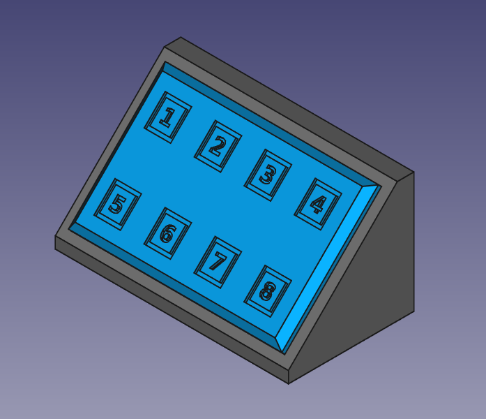
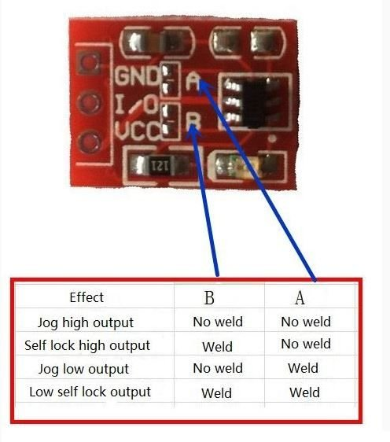

# 3D-Printed_TTP223_Keypad-8

A simple keypad for your TTP223 chips, 8 separate keypads with an open bottom enclosure that has two screw holes for mounting.

The TTP223 can be used with a development board by connecting the I/O pin to an input and monitor the state of the input with your program.

You can also control A relay module directly without a development board as well..

